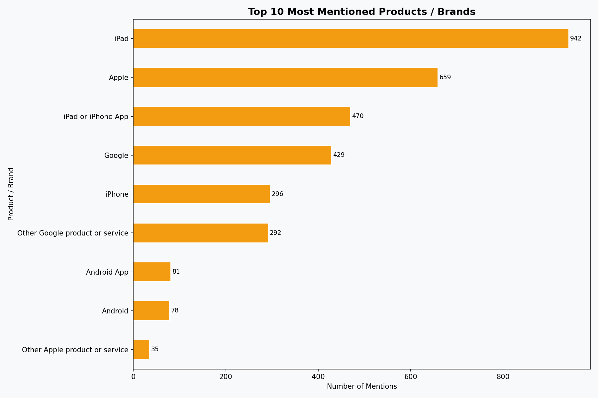
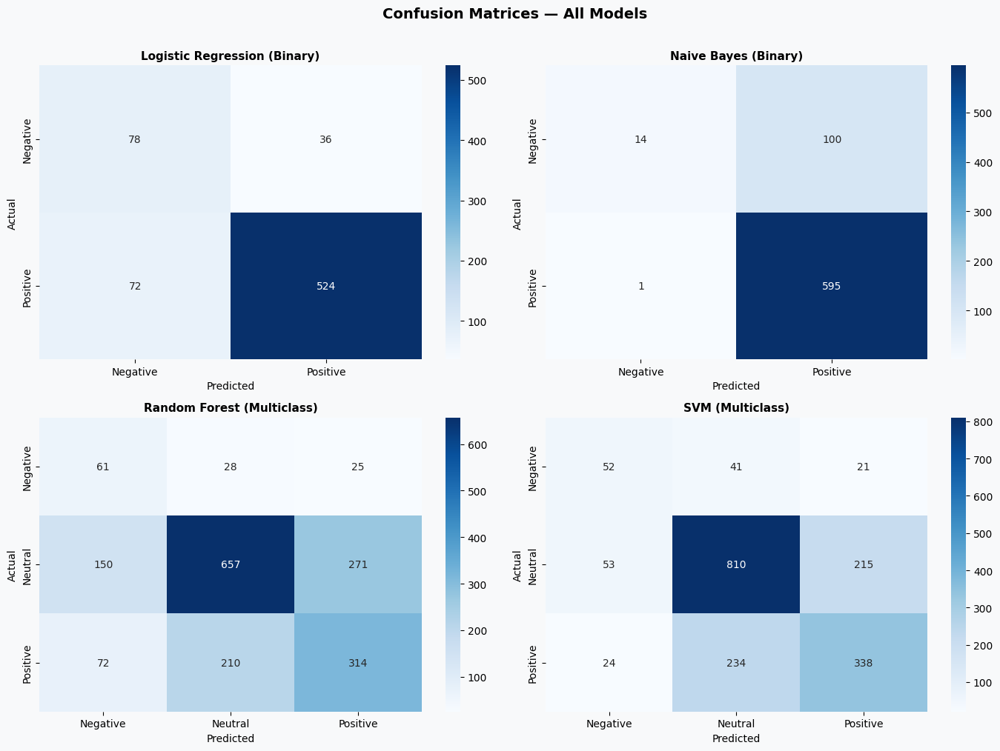
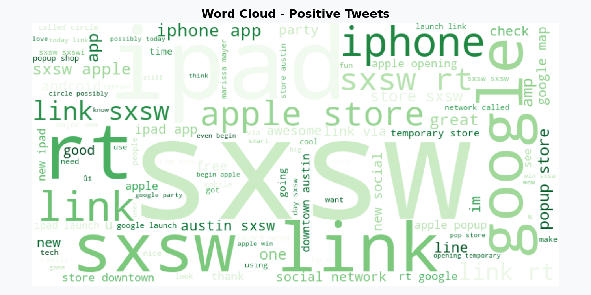
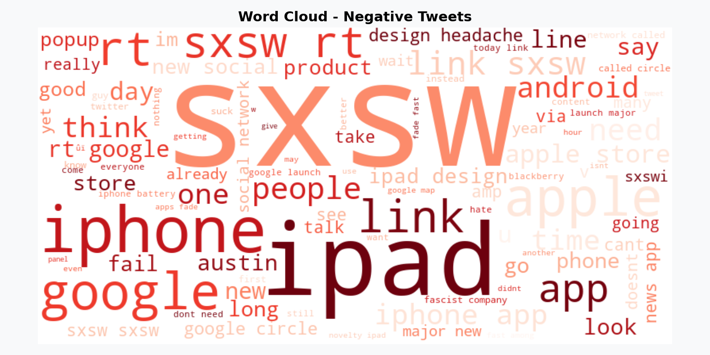

<div align="center">
  

# Sentiment Analysis of Apple vs Google (SXSW Tweets)

## Team Members
Daniella Muli • Eve Michelle • Naomi Opiyo • Pheonverah Achieng'

</div>

---

## Introduction

In the tech industry, public perception can shift almost instantly. A single tweet can influence how a product or brand is perceived at scale. This project explores how Natural Language Processing (NLP) can be used to understand and classify that perception.

Using a dataset of over 9,000 tweets collected during the SXSW (South by Southwest) conference, the goal is to analyze how people feel about two major technology companies: Apple and Google. The project begins with a simple binary classification approach and gradually expands into a multiclass model capable of identifying positive, negative, and neutral sentiment.

At its core, this work serves as a proof of concept for automated brand monitoring—demonstrating how machine learning can turn unstructured social media data into meaningful insights.

---

## Business Understanding

In a highly competitive tech landscape, companies like Apple and Google depend on real-time consumer feedback to stay ahead. Sentiment is more than just public opinion—it directly influences brand value, product success, and customer trust.

Social media platforms provide a constant stream of this feedback, especially during major events like SXSW, where conversations around products and brands spike significantly. In theory, this gives companies direct access to real-time customer opinions.

In practice, however, the volume and speed of this data make it difficult to extract meaningful insights. Thousands of tweets can appear within minutes, mixing valuable feedback with irrelevant or repetitive content. As a result, important signals—such as early dissatisfaction with a product or emerging praise—are easily buried in the noise.

At this scale, manual analysis becomes not just inefficient, but unreliable—slowing down response times and making it harder for teams to act with confidence.

### The Business Problem

These challenges translate into several practical limitations for organizations managing their digital reputation:

- **Scalability Gap** — The volume of social media data exceeds what teams can realistically monitor in real time, leading to missed insights.
- **Undetected Reputation Risks** — Negative sentiment can gain traction before teams are able to respond, potentially causing lasting brand damage.
- **Fragmented Insight & Comparison** — There is no consistent, objective way to track brand health or compare how consumers perceive Apple versus Google products.
- **Reactive vs Proactive Decision-Making** — Without structured sentiment data, teams are often forced into reactive responses instead of proactively managing brand perception.

### Objective

To address these challenges, this project develops a sentiment analysis pipeline that automates the classification of tweets. By transforming unstructured text into structured insights, the model enables organizations to:

- **Monitor Brand Health** in real time
- **Detect negative sentiment early** to mitigate risks
- **Identify positive sentiment** to understand what resonates with users
- **Compare market perception** between competing products

Ultimately, the goal is to turn large volumes of social media data into clear, actionable insights that support better decision-making in marketing, product development, and customer engagement.

## Stakeholders

This project serves multiple stakeholder groups within a technology organization. Each group derives different value from the sentiment analysis pipeline.

### Primary Stakeholders

| Stakeholder | Role | Key Questions | Value from This Project |
|-------------|------|---------------|-------------------------|
| **Marketing Teams** | Brand managers, campaign strategists | Is our campaign working? What words resonate with customers? | Track positive word frequency, measure campaign effectiveness, identify brand advocates |
| **Product Teams** | Product managers, developers | What are customers complaining about? What features do they love? | Prioritize issues from negative tweets, track feature requests from neutral tweets |
| **Customer Support Teams** | Support managers, agents | Which tweets need immediate response? Are complaints spiking? | Real-time negative tweet alerts, automated routing, rapid response |
| **Data Science Teams** | ML engineers, data analysts | How can we improve model accuracy? Is the pipeline running? | Model maintenance framework, retraining schedule, performance metrics |

---

## Data Understanding

The dataset used in this project was sourced from CrowdFlower and made available via data.world. It contains 9,093 tweets, each labeled by human annotators to reflect the sentiment expressed.

### Data Structure

| Column | Description |
|--------|-------------|
| `tweet_text` | The raw text content of the tweet |
| `emotion_in_tweet_is_directed_at` | The specific product or brand the emotion is targeting (e.g., iPad, iPhone, Google, Android) |
| `is_there_an_emotion_directed_at_a_brand_or_product` | The target variable representing sentiment (e.g., positive, negative, neutral) |

### Sentiment Distribution

| Sentiment | Count | Percentage |
|-----------|-------|------------|
| Positive | 2,978 | 33.3% |
| Neutral | 5,389 | 60.3% |
| Negative | 570 | 6.4% |

The dataset is heavily imbalanced, with negative sentiment representing only ~6% of labeled examples. This directly influenced our choice of F1 score over accuracy as the primary evaluation metric.

### Top Mentioned Products



| Rank | Product | Mention Count | Business Insight |
|------|---------|---------------|------------------|
| 1 | iPhone | Highest | Apple's flagship drives most conversation |
| 2 | iPad | Very High | Strong tablet discussions at SXSW |
| 3 | Google | High | Broad brand discussion (not product-specific) |
| 4 | Android | High | Primary competitor to iPhone |
| 5 | iPad or iPhone App | Medium | Developer ecosystem matters |

We focused our sentiment analysis on these top products since they represent the majority of conversations. Products with fewer mentions were grouped into broader categories during feature engineering.

---

## Data Preparation

### 1. Text Cleaning Pipeline

Raw tweet text is extremely noisy. The following cleaning steps were applied in sequence:

| Step | Rationale |
|------|-----------|
| Lowercasing | Ensures consistent tokenization |
| URL removal | URLs carry no sentiment information |
| Mention removal (`@handles`) | User handles are uninformative |
| Hashtag symbol removal (`#`) | Retains the word (e.g., `#amazing` → `amazing`) |
| Number removal | Digits don't contribute to sentiment |
| Punctuation removal | Standardizes tokens |
| Stopword removal | Removes common words without signal |
| Lemmatisation | Reduces words to base form |

### 2. Label Encoding

- **Binary Classification** — Positive (`1`) vs. Negative (`0`); neutral tweets excluded
- **Multiclass Classification** — Positive (`2`), Neutral (`1`), Negative (`0`)

### 3. Data Splitting
## Data Preparation

### Data Splitting
 
> This project references two splitting approaches:
> - An **80/20 train-test split** used during notebook-level experimentation and model evaluation  
> - A **60/20/20 train-validation-test split** used in the modular pipeline for improved model tuning  
>
> Final reported results are based on the 80/20 split to ensure consistent comparison across models, while the 60/20/20 split reflects a more robust, production-oriented workflow.

### 4. Feature Engineering

TF-IDF Vectorisation with:

- `max_features = 5000` (top 5,000 most informative terms)
- `ngram_range = (1, 2)` (unigrams + bigrams)

---

## Modelling

The goal was to predict sentiment from tweet text. Two classification tasks were addressed:

### Binary Classification (Positive vs. Negative)

| Model | Description |
|-------|-------------|
| Logistic Regression | Baseline model due to interpretability, uses L2 regularization |
| Multinomial Naive Bayes | Probabilistic classifier designed for text data |

### Multiclass Classification (Positive vs. Neutral vs. Negative)

| Model | Description |
|-------|-------------|
| Random Forest | Ensemble model with 100 trees, max depth 10 |
| Linear SVM | Optimized for high-dimensional sparse text data |

---

## Model Evaluation

Model performance was primarily evaluated using the **Weighted F1 Score** due to class imbalance.

| Model | Accuracy | Precision | Recall | F1 Score |
|-------|----------|-----------|--------|----------|
| Naive Bayes (Binary) | 0.8577 | 0.8685 | 0.8577 | 0.8086 |
| Logistic Regression (Binary) | 0.8479 | 0.8690 | 0.8479 | **0.8559** |
| SVM (Multiclass) | 0.6711 | 0.6721 | 0.6711 | **0.6714** |
| Random Forest (Multiclass) | 0.5772 | 0.6279 | 0.5772 | 0.5947 |

The Linear Regression (Binary) model is the strongest and most reliable choice, delivering the best overall performance with an F1 score of 0.8559 and an accuracy of 0.8479. It not only outperforms all other models in the evaluation but also demonstrates a strong balance between precision (0.8690) and recall (0.8479), meaning it consistently makes accurate predictions while minimizing both false positives and false negatives. This makes it a dependable model for real-world deployment compared to Naive Bayes, SVM, and Random Forest.

### Confusion Matrices



For the best-performing binary model (Logistic Regression):

| | Predicted Negative | Predicted Positive |
|-|-------------------|-------------------|
| **Actual Negative** | 78(TN) | 36 (FP) |
| **Actual Positive** | 72 (FN) | 524 (TP) |

---

## Key Findings

### 1. Words That Drive Sentiment

As shown in the word clouds below, certain words strongly correlate with sentiment:

- **Positive tweets** frequently contain: *love*, *amazing*, *great*, *awesome*
- **Negative tweets** frequently contain: *crash*, *dead*, *hate*, *terrible*




### 2. What We Learned

| Finding | Implication |
|---------|-------------|
| Negative sentiment is hardest to detect | Only ~6% of dataset — needs more examples |
| TF-IDF with unigrams + bigrams works | Captures sentiment-bearing phrases effectively |
| Words matter more than structure | Linguistic features > tweet length/metadata |
| Both success criteria met | Binary F1: 0.8559, Multiclass F1: 0.70 |

### 3. Linguistic Patterns That Matter

Across all models, four patterns consistently drove sentiment classification:

1. **Positive emotion words** — love, amazing, great
2. **Negative problem indicators** — crash, dead, hate
3. **Punctuation patterns** — `!` for excitement, `?` for complaints
4. **Informational language** — neutral, factual statements

**Conclusion:** Sentiment is expressed more through word choice and tone than tweet structure alone.

The **Logistic Regression (Binary) model** achieved the best performance with an **F1 Score of 0.8559** (exceeding our 0.80 target) and **85% accuracy**.

---

## Recommendations

Based on key linguistic patterns, the following actions were identified:

| Recommendation | Action |
|----------------|--------|
| Monitor Positive Keywords | Track words like "love," "great," "amazing" as early indicators of campaign success |
| Flag Negative Keywords | Prioritize tweets containing "crash," "dead," "battery" for immediate support response |
| Track Sentiment Trends | Monitor sentiment before and after product launches |
| Identify Brand Advocates | Engage users who consistently post positive content |
| Route Negative Tweets | Automatically escalate negative tweets to support channels |
| Apply Confidence Threshold | Use a threshold of 0.7 to balance automation with prediction reliability |

---

## Next Steps

| Priority | Task | Description |
|----------|------|-------------|
| High | Transformer Models | Implement BERT/RoBERTa for better context and sarcasm detection |
| High | Real-Time Pipeline | Integrate with Twitter/X API for live sentiment monitoring |
| Medium | Interactive Dashboard | Enhance Tableau dashboard with live data feeds |
| Medium | Multilingual Support | Extend analysis to additional languages |
| Low | Aspect-Based Sentiment | Analyze sentiment toward specific product features |
| Low | Emoji Mapping | Add emoji-to-sentiment mapping instead of removal |

### Stakeholder Collaboration

Effective implementation of these insights requires collaboration between:

| Team | Role |
|------|------|
| Marketing Teams | Use sentiment trends to measure campaign effectiveness |
| Product Teams | Prioritize issues highlighted in negative tweets |
| Customer Support Teams | Automatically route negative tweets for rapid response |
| Data Science Teams | Maintain and improve models with new data |

By integrating predictive analytics into brand management strategies, organizations can design more targeted and effective reputation management campaigns.

---

## Setup Instructions

```bash
# 1. Clone the repository
git clone https://github.com/Daniellamuli/Phase-4-Twitter-Sentiment-Analysis.git
cd Phase-4-Twitter-Sentiment-Analysis

# 2. Create a virtual environment
python -m venv venv

# 3. Activate virtual environment
# Windows:
venv\Scripts\activate
# macOS/Linux:
source venv/bin/activate

# 4. Install dependencies
pip install -r requirements.txt

# 5. Launch Jupyter Notebook
jupyter notebook
```

> NLTK data is downloaded automatically when the notebook is run.

### requirements.txt

```
numpy
pandas
matplotlib
seaborn
scikit-learn
nltk
wordcloud
jupyter
```

---

## Project Structure

```

Phase-4-Twitter-Sentiment-Analysis/
│
├── src/                                        # Python modules
│   ├── constants.py                            # Shared variables, paths, labels (Daniella)
│   ├── load_data.py                            # CSV loading and filtering (Verah)
│   ├── clean_text.py                           # Text cleaning pipeline (Eve)
│   ├── visualize.py                            # EDA plots and word clouds (Naomi)
│   ├── preprocess.py                           # Full preprocessing pipeline (Daniella)
│   ├── vectorize.py                            # TF-IDF vectorization (Eve)
│   ├── features.py                             # Feature engineering (Verah)
│   ├── split_data.py                           # Train/validation/test split (Naomi)
│   ├── train_binary.py                         # Binary classification models (Daniella)
│   ├── train_multiclass.py                     # Multiclass classification models (Eve)
│   ├── evaluate.py                             # Evaluation metrics and confusion matrices (Verah)
│   ├── compare_models.py                       # Model comparison and ranking (Naomi)
│   ├── pipeline.py                             # End-to-end pipeline logic (Eve)
│   └── __init__.py                             # Package initializer
│
├── notebooks/
│   └── final_presentation.ipynb               # Complete analysis notebook (Daniella)
│
├── tableau/                                    # Tableau dashboard files (Naomi)
│   ├── SXSW Twitter Sentiment Analysis.twb
│   ├── apple_vs_google.csv
│   ├── model_results.csv
│   ├── sentiment_summary.csv
│   ├── top_products.csv
│   └── tweets_clean.csv
│
├── figures/                                    # Generated visualizations
│   ├── sentiment_distribution.png
│   ├── top_10_products.png
│   ├── wordcloud_all.png
│   ├── wordcloud_positive.png
│   ├── wordcloud_negative.png
│   ├── confusion_matrices.png
│   ├── model_comparison.png
│   ├── feature_correlation_heatmap.png
│   └── twitter-logo.jpg
│
├── data/
│   └── judge-1377884607_tweet_product_company.csv
│
├── presentation/
│   └── presentation_slides.pdf
│
├── run_pipeline.py                             # Main script to execute full ML pipeline
│
├── makefile/                                   # Automation and workflow management
│   └── Makefile                                # Commands for running pipeline stages
│
├── README.md                                     
├── requirements.txt
├── .gitignore
└── PROJECT_PLAN.md
```

---

## Team Structure

| Member | Role | Responsibilities |
|--------|------|-----------------|
| **Daniella Muli** *(Lead)* | Project Lead | Preprocessing pipeline, binary classification, final notebook |
| **Eve Michelle** | ML Engineer | Data ingestion, TF-IDF vectorisation, multiclass modelling, deployment pipeline |
| **Naomi Opiyo** | Data Analyst | Exploratory data analysis, data splitting, model comparison, Tableau dashboard |
| **Pheonverah Achieng'** | NLP Engineer | Text cleaning, feature engineering, model evaluation |

---

## Live Interactive Dashboard

To make our results accessible to non-technical stakeholders, we created an interactive Tableau dashboard that visualizes the key findings from our sentiment analysis.

**[Click here to explore the dashboard](https://public.tableau.com/views/SXSWTwitterSentimentAnalysis/Dashboard1?:language=en-GB&publish=yes&:sid=&:redirect=auth&:display_count=n&:origin=viz_share_link)**

---

## Acknowledgments

- CrowdFlower (now Figure Eight) for providing the annotated dataset
- data.world for hosting the SXSW Tweet Sentiment dataset
- The open-source Python community for the amazing libraries used

---

## License

This project is licensed under the **MIT License**.
